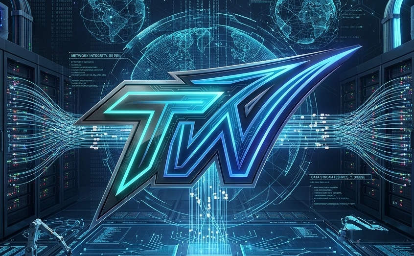

<p align="center">
  
</p>

# TailWarp

Geometric methods for tail-aware risk optimization using GPU acceleration.

## Showcase

| Capability | Status | Evidence |
|------------|--------|----------|
| CPU Python API (`TailWarpClient`) | ✅ Shipped | `pip install .` — CVaR, drawdown, sizing, warning state |
| Black Swan replay (CPU) | ✅ Measured | [benchmarks/results/sample_black_swan/](benchmarks/results/sample_black_swan/) |
| Benchmark schema v2 | ✅ Locked | [benchmarks/results_schema.json](benchmarks/results_schema.json) |
| GPU microbenches | ⚙️ Manual | [`.github/workflows/gpu-smoke.yml`](.github/workflows/gpu-smoke.yml) (`workflow_dispatch`) |
| CI (free-plan safe) | ✅ CPU pytest | [`.github/workflows/ci.yml`](.github/workflows/ci.yml) on `main` / `develop` |

**Headline numbers (CPU sample replay):** +54 h lead time vs variance EWMA baseline — see [RESULTS.md](RESULTS.md) Test 4.

## Overview

TailWarp implements **Black Swan Defense** — a GPU-accelerated framework for tail-aware risk measurement and survival under heavy-tailed distributions. Current focus (S2-01) is on validated primitives: solvency distance, drawdown pain, CVaR-constrained sizing, and Student-t sampling for realistic fat-tail scenarios.

**Why Black Swan Defense?**
Black swans (rare, unpredictable extreme events) live in "Extremistan" where:
- Traditional mean-variance models fail
- Tail risk dominates realized losses
- **We cannot eliminate black swan risk, only mitigate and antifragility-position**

See [RESULTS.md](RESULTS.md) for the full claim-vs-measured separation and S2-01 scope lock.

**Implemented & Validated Today** (Phase 1 — Survival Baseline)
- ✅ GPU sampling: Student-t, Gaussian (univariate)
- ✅ CUDA metrics: solvency distance, drawdown/pain, exposure/leverage (see `src/core/`)
- ✅ Host API: VaR / CVaR / summary stats; wrappers call GPU samplers
- ✅ Example CLIs: `experiment_run` (artifact folder), `cvar_position_sizing`
- ✅ Warning state framework (green/yellow/red/critical with deterministic thresholds)

**Planned & Partial** (Phase 2–3, explicitly excluded from S2-01 headline; see [docs/project-plan-docs/07-RISK-SIMPLE-PLAN.md](docs/project-plan-docs/07-RISK-SIMPLE-PLAN.md))
- ⚠️ **[PLANNED]** SPD manifold (`spd_log` / `spd_distance` — GPU placeholders only)
- ⚠️ **partial** Host `sample_covariance_with_ridge` only (not Tyler's M-estimator)
- ⚠️ α-stable and multivariate samplers; EVT / POT tail validation
- ⚠️ Riemannian optimization (geodesic distance, trust-region hedging)

## Quick Start

### Python API (CPU — no CUDA toolkit)

```bash
pip install .
python -c "from tailwarp import TailWarpClient; print(TailWarpClient().compute_cvar([-0.1, -0.05, 0.0, 0.02]))"
```

See [docs/python-api.md](docs/python-api.md) and [docs/deployment.md](docs/deployment.md).

### C++ / CUDA build

```bash
# Configure and build (tests + examples + CUDA microbenches)
cmake -B build -DBUILD_TESTS=ON -DBUILD_BENCHMARKS=ON
cmake --build build

# Tests
ctest --test-dir build --output-on-failure

# Record a minimal experiment folder (see docs/EXPERIMENTS.md)
./build/examples/experiment_run configs/experiment_student_t_cvar.json

# CVaR sizing demo
./build/examples/cvar_position_sizing --config configs/example_cvar_sizing.json
```

Optional: `make` builds CUDA objects only (see [Makefile](Makefile)); prefer CMake for full linking.

## Project Structure

```
TailWarp/
├── src/               # CUDA kernels, wrappers, algorithms
├── tests/             # Unit tests, validation, integration tests
├── app/               # Optional Streamlit dashboards (CPU)
├── benchmarks/        # Performance evaluation suite
├── configs/           # Experiment configurations
├── data/              # Input data and experiment outputs
├── scripts/           # Build and validation scripts
└── docs/              # Documentation and research notes
```

## Requirements

- CUDA 11.0+
- CMake 3.18+ or Make
- C++17 compiler
- GPU with compute capability 8.6+ (RTX 30-series or newer)
- Optional: GTest for tests, Python 3.8+ for scripts

## Research Focus

Based on "Statistical Consequences of Fat Tails" (Taleb) and Riemannian optimization literature:

1. **Position Sizing**: CVaR-constrained sizing via geodesic convex optimization
2. **Robust Covariance**: Tyler's M-estimator on SPD manifold with affine-invariant metric
3. **Hedging**: Correlation uncertainty via Riemannian trust regions
4. **Option Pricing**: Anchor-based tail pricing using EVT

See [docs/ideas-plan.md](docs/ideas-plan.md) and [docs/project-plan-docs/](docs/project-plan-docs/) for workflow.

## Black Swan dashboard (optional, CPU-only)

Install Python dependencies, then run from the repository root:

```bash
pip install -r app/requirements-black-swan-dashboard.txt
streamlit run app/streamlit_black_swan_dashboard.py
```

The sidebar **Run** list discovers every `benchmarks/results/<run_id>/` folder with `results.json` (not only the sample bundle). Use **Custom bundle path** for other directories. See [dashboard/README.md](dashboard/README.md). Replay rows live under `data/input/sample_replays/`. No GPU is required for this path.

### Black Swan replay benchmark (CPU-safe)

Regenerate the sample artifact bundle from the repository root:

```bash
pip install -r app/requirements-black-swan-dashboard.txt
python benchmarks/run_black_swan_benchmark.py --config benchmarks/configs/black_swan_replay.json
```

Outputs land in `benchmarks/results/sample_black_swan/` (`results.json`, `summary.md`, `tailwarp_vs_variance.csv`, plots, and `environment.json`). See [benchmarks/README.md](benchmarks/README.md) for config schema.

## Known limitations

Every public metric is tagged in [docs/VALIDATION.md](docs/VALIDATION.md) as `verified`, `partial`, or `placeholder` / `[PLANNED]`.

- **Univariate only** for headline claims — multivariate tails and correlation are not measured.
- **CVaR** uses host historical quantile in `risk_metrics.cpp`, not a GPU sort kernel (`partial`).
- **Black Swan replay** defaults to CPU orchestration (`cpu_sample`); CUDA-measured rows require a native build and `cuda_measured` config — see [docs/EXECUTION_MANIFEST.md](docs/EXECUTION_MANIFEST.md).
- **SPD manifold** and **Tyler robust covariance** are `[PLANNED]` — do not cite in headlines.
- **Drawdown / ruin / exposure CUDA kernels** exist but lack full golden GPU-vs-reference coverage in CI (CPU tests + manual GPU parity per [Tech-Debt.md](Tech-Debt.md) TD-TW-02).
- **Posture metrics** in replay bundles are CPU heuristics until Lens-5 kernels ship (`cpu_replay_heuristic`).
- **Throughput table** in `RESULTS.md` is representative, not locked to CI hardware — reproduce via `python benchmarks/run_benchmarks.py` after S7.

Architecture: Python orchestrates; numerics live in CUDA/C++ — [docs/ARCHITECTURE_BOUNDARY.md](docs/ARCHITECTURE_BOUNDARY.md).

## Documentation

- **Python API:** [docs/python-api.md](docs/python-api.md) — `TailWarpClient`, install matrix, fallbacks
- **Deployment:** [docs/deployment.md](docs/deployment.md) — Docker CPU/CUDA, env vars
- **Integrations (v2.0 prep):** [docs/integrations.md](docs/integrations.md) — mock consumer contracts
- **API contract:** [docs/python-api-contract.md](docs/python-api-contract.md)
- **Architecture boundary:** [docs/ARCHITECTURE_BOUNDARY.md](docs/ARCHITECTURE_BOUNDARY.md) — CUDA-first; Python orchestration only
- **S7 run matrix (planned):** [docs/EXECUTION_MANIFEST.md](docs/EXECUTION_MANIFEST.md)
- **Results & Claims:** [RESULTS.md](RESULTS.md) — Separates target Black Swan Defense claims from measured results (S2-01)
- **Research Plan**: [docs/ideas-plan.md](docs/ideas-plan.md)
- **Workflow**: `docs/project-plan-docs/QUICK-REFERENCE.md`
- **Experiments**: `docs/EXPERIMENTS.md`
- **Validation**: `docs/VALIDATION.md`

## License

See LICENSE file.
