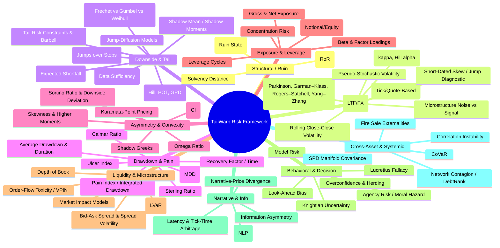

# 1. Key sources for the metrics

These are the main external sources I’m relying on, beyond your internal docs:

- TailWarp / internal docs:
  - remarks-on-MDA.md – MDA, tail index α, Wittgenstein’s Ruler heuristic, κ metric, shadow mean, short-dated skew, quasi-static hedging, Lucretius fallacy, Karamata-point pricing, MAD vs STD, etc.
  - risk-categories-init.md & ten-lenses.md – the 10-lens risk framework and chapter mappings to Taleb / Gatheral.
  - chapter-lens-mapping.md, fattail-book-chapters-suggested.md, fattail-volatility-surface-books.md, papers-to-init.md – chapter and paper mappings.

- EVT / fat-tails:
  - Tail index and EVT / MDA:
    - General EVT references, tail index estimation, Hill estimator, POT, and Maximum Domains of Attraction (Fréchet, Gumbel, Weibull)【turn4search0】【turn4search1】【turn4search3】【turn4search9】.
    - Tail index estimation and Hill-type estimators for Pareto tails【turn4search5】【turn4search8】.
  - κ metric:
    - Taleb, “How Much Data Do You Need? An operational, pre-asymptotic metric for fat-tailedness” – defines κ∈[0,1] measuring fat-tailedness / sample-size requirement【turn4search10】【turn4search14】.
  - Shadow mean / shadow moments:
    - Taleb’s “Statistical Consequences of Fat Tails” and related work emphasize that under fat tails the sample mean is unstable and underestimates the true mean, and introduces “shadow moments” via a dual distribution and EVT to estimate means in apparently infinite-mean settings【turn5search17】【turn5search18】.
    - Pareto mean formula E[X]=L·α/(α−1) for α>1 is standard【turn5search5】.
  - Wittgenstein’s Ruler heuristic (reject Gaussian on huge “sigma” events) is framed in your docs; Taleb’s broader work criticizes VaR and Gaussian assumptions and supports the practice of abandoning Gaussian models after extreme moves【turn2search15】.

- Drawdown & performance ratios:
  - Ulcer Index (drawdown-based downside risk measure, by Peter Martin & Byron McCann)【turn1search15】【turn1search16】【turn1search17】.
  - Sortino Ratio and downside deviation【turn3search0】【turn3search2】【turn3search3】.
  - Omega Ratio (probability-weighted gains vs losses for a threshold)【turn3search5】【turn3search6】【turn3search9】.
  - Calmar Ratio (annual return divided by maximum drawdown)【turn3search10】【turn3search11】【turn3search12】.
  - Sterling Ratio (return divided by average drawdown)【turn3search15】【turn3search16】【turn3search18】.

- Systemic / network / leverage:
  - CoVaR – systemic risk measure: change in VaR of the financial system conditional on an institution’s distress【turn0search0】【turn0search1】【turn0search3】【turn0search4】.
  - DebtRank – network-based systemic impact and contagion in financial networks【turn0search5】【turn0search6】【turn0search8】【turn0search9】.
  - Leverage cycles – Geanakoplos’ work on equilibrium leverage and its role in bubbles and crises【turn1search0】【turn1search1】【turn1search2】【turn1search3】.

- Liquidity & microstructure:
  - Liquidity-Adjusted VaR (LVaR) – extends VaR with a liquidity component (bid–ask spreads, depth), going back to Bangia, Diebold, Schuermann & Stroughair【turn0search15】【turn0search16】【turn0search18】【turn0search19】.
  - VPIN (Volume-Synchronized Probability of Informed Trading) – flow toxicity metric; Easley, López de Prado, O’Hara【turn0search10】【turn0search11】【turn0search12】【turn0search13】【turn0search14】.
  - Market impact and microstructure-based realized volatility (Engle & Zheng)【turn2search9】.
  - Bid–ask spread / liquidity measures for FX specifically【turn2search14】.

- Decision & behavioral / model risk:
  - Knightian uncertainty – risk vs unmeasurable uncertainty; Knight’s Risk, Uncertainty and Profit, and modern overviews【turn1search5】【turn1search6】【turn1search7】【turn1search8】【turn1search9】.
  - Model risk – Morini “Understanding and Managing Model Risk”, with a comprehensive taxonomy for model risk in pricing and risk management【turn1search10】【turn1search11】【turn1search12】.
  - Taleb’s Logic of Risk Taking and other pieces on repeated exposure and tail risks【turn2search18】.

- Lower-timeframe (LTF) / no-volume (FX) proxies:
  - Range-based volatility estimators (Parkinson, Garman–Klass, Rogers–Satchell, Yang–Zhang etc.) using only OHLC prices【turn2search0】【turn2search1】【turn2search2】【turn2search3】【turn2search8】.
  - Realized volatility approaches and high-frequency FX risk studies using quote/tick data rather than volume【turn2search9】【turn2search11】【turn2search13】【turn2search14】.

Now, with those in hand, I’ll consolidate categories and methods.

---

# 2. Consolidated risk categories & methods (with sources)

I’ll stick to your 10-lens structure, add missing methods, and emphasize:

- Short-term risks (intraday, gaps, LTF behavior)  
- Systemic and decision-making risks  
- FX / no-volume metrics (OHLC, tick, spread-based)

For each method: short explanation + key sources.

---

### Lens 1 – Structural / Ruin Risk

1) Risk of Ruin (RoR)  
   - What it is: Probability of hitting capital zero or a pre-defined absorbing barrier (e.g., margin call) over a horizon.  
   - Why: Captures whether a strategy can survive repeated adverse bets.  
   - Sources: Classic risk-of-ruin formulas; related to Taleb’s ruin/absorbing-barrier framing in “Statistical Consequences of Fat Tails” (Ch. 23, Lindy as distance from absorbing barrier)【turn5search18】.

2) Absorbing Barriers / Ruin State  
   - What it is: Hard constraint that ends the game (e.g., portfolio liquidation, regulatory shutdown).  
   - Why: TailWarp wants to treat ruin as a boundary condition, not just another tail event.  
   - Sources: Taleb Ch. 23 (Lindy as distance from an absorbing barrier) in your docs【turn5search18】.

3) Solvency Distance / Distance to Ruin  
   - What it is: How many CVaR-scale losses you can take before hitting the ruin barrier.  
   - Why: Translates abstract ruin probability into a budget-like metric.  
   - Sources: Conceptually tied to CVaR-based constraints (Rockafellar & Uryasev style EVT/VaR work) and ruin theory in TailWarp’s own design.

---

### Lens 2 – Volatility & Noise (incl. LTF, no-volume FX)

4) Rolling Close-Close Volatility (LTF)  
   - What it is: Standard deviation of returns over short windows (e.g., 5m, 15m, 1h).  
   - Why: Basic, but heavily misused under fat tails (Taleb strongly criticizes over-reliance on σ)【turn2search15】.  
   - Sources: Standard textbooks; also general discussions on realized volatility proxies【turn2search8】.

5) Range-Based Volatility Estimators (Parkinson, Garman–Klass, Rogers–Satchell, Yang–Zhang)  
   - What it is: Volatility estimators that use OHLC only (no volume), exploiting high–low price range.  
   - Why: Ideal for FX (no volume) and for LTF bars where only OHLC is available. They’re more efficient than close-close in many conditions【turn2search1】【turn2search3】【turn2search8】.  
   - Sources:  
     - Parkinson estimator; Garman–Klass; Rogers–Satchell; Yang–Zhang – standard range-based estimators【turn2search0】【turn2search1】【turn2search8】.  
     - Studies showing range-based estimators are competitive with high-frequency realized volatility for short-term forecasting【turn2search3】【turn2search6】.

6) Realized Volatility (Tick/Quote-Based) for FX  
   - What it is: Sum of squared intraday returns using tick or mid-quote data, to estimate volatility over short horizons without volume.  
   - Why: More precise for LTF risk; can be used where trades aren’t available but quotes are.  
   - Sources:  
     - Engle & Zheng’s “A Microstructure Estimate of Realized Volatility”【turn2search9】.  
     - FX-specific high-frequency risk assessment (e.g., USD/JPY minute-level risk)【turn2search11】【turn2search14】.

7) Regime Detection via Volatility & Tail State (κ, Hill α)  
   - What it is: Classify time periods into “calm” vs “stormy” regimes based on volatility, tail index, and κ.  
   - Why: Helps adapt risk behavior and distinguish noise from structural turbulence in LTF data.  
   - Sources:  
     - κ metric (Taleb 2019) for fat-tailedness / data-sufficiency【turn4search10】【turn4search14】.  
     - Tail index / Hill estimator literature【turn4search3】【turn4search5】【turn4search9】.

8) Microstructure Noise vs Signal  
   - What it is: Separating true price movements from bid–ask bounce, discrete ticks, and quote noise.  
   - Why: Critical for LTF FX; noise can masquerade as volatility or hide tail risk.  
   - Sources: Microstructure literature on realized vol and noise (Engle & Zheng, etc.)【turn2search9】【turn2search13】.

9) Pseudo-Stochastic Volatility (Power-Law Masquerading)  
   - What it is: Constant power-law tails can look like stochastic volatility regimes (Taleb Ch. 5.6).  
   - Why: Avoid overfitting “regimes” when tails alone explain observed patterns.  
   - Sources: Taleb Ch. 5.6 (Pseudo-stochastic volatility: an investigation) in your docs.

10) Short-Dated Skew & Jump Diagnostic  
    - What it is: Monitoring far-OTM option prices vs ATM as T→0 to detect jump-diffusion / fat-tail dynamics.  
    - Why: In LTF, standard diffusion models fail; skew explosion signals jumps / Fréchet regime.  
    - Sources: Gatheral “The Volatility Surface”, esp. short-dated behavior and adding jumps【turn0search0】【turn0search5】 (implied from your mappings).

---

### Lens 3 – Downside & Tail Risks

11) Value at Risk (VaR) & Conditional VaR (CVaR / Expected Shortfall)  
    - What it is: VaR = quantile of loss distribution; CVaR = average loss beyond VaR.  
    - Why: CVaR is coherent and better suited for fat tails; central to TailWarp Gates A/B.  
    - Sources:  
      - Standard QRM/EVT references (e.g., Haugh’s EVT notes)【turn4search1】【turn4search3】.  
      - Taleb’s discussion of VaR & CVaR (Ch. 2.2.19) in your docs.

12) Maximum Domain of Attraction (MDA) Diagnosis (Fréchet vs Gumbel vs Weibull)  
    - What it is: Determining whether the distribution of extremes is Fréchet (power-law fat tails), Gumbel (light tails), or Weibull (bounded).  
    - Why: Decides whether Gaussian/EVT assumptions are valid.  
    - Sources:  
      - Standard EVT textbooks – MDA classification and tail diagnostics【turn4search0】【turn4search1】【turn4search3】【turn4search4】.

13) Tail Index α Estimation (Hill, POT, GPD)  
    - What it is: Estimating α where survival tail ≈ x^−α; used via Hill estimator or Peaks-Over-Threshold (GPD).  
    - Why: α drives all tail-based pricing and risk metrics, including shadow mean and Karamata-point pricing.  
    - Sources:  
      - Hill estimator and tail index estimation literature【turn4search5】【turn4search8】【turn4search9】.  
      - TailWarp’s EVT pipeline.

14) κ Metric for Data Sufficiency  
    - What it is: Pre-asymptotic metric of fat-tailedness, κ∈[0,1]; higher κ means need more data for stable mean estimation.  
    - Why: Tells you whether LTF backtests (e.g., 3 months of 5m data) are even close to stable.  
    - Sources: Taleb “How Much Data Do You Need? An operational, pre-asymptotic metric for fat-tailedness”【turn4search10】【turn4search14】.

15) Shadow Mean / Shadow Moments  
    - What it is: Estimating the true (often hidden or “shadow”) mean of a fat-tailed process via EVT / dual distributions, instead of the biased sample mean.  
    - Why: In fat-tailed environments, the sample mean severely underestimates the true mean and risk of rare events.  
    - Sources:  
      - “On the shadow moments of apparently infinite-mean distributions” (Bree & Taleb)【turn5search17】.  
      - Taleb “Statistical Consequences of Fat Tails” emphasizes bias of sample mean and use of EVT-based estimators【turn5search18】.  
      - Pareto mean formula E[X]=L·α/(α−1) for α>1【turn5search5】.

16) Gap Risk (Jump-to-Ruin, Jumps Over Stops)  
    - What it is: Risk that price gaps past stop-loss levels; especially relevant for LTF and overnight moves.  
    - Why: Dynamic delta-hedging and standard stops fail under jumps.  
    - Sources:  
      - Gatheral Ch. 5 (Adding Jumps)【turn0search5】.  
      - Jump-diffusion literature in EVT and options pricing【turn4search3】.

17) Jump-Diffusion Models  
    - What it is: Combining Brownian diffusion with Poisson-driven jumps; used for more realistic short-dated and LTF modeling.  
    - Why: Necessary to match observed skew and tail behavior in LTF options.  
    - Sources: Gatheral’s “Adding Jumps” chapter【turn0search5】.

18) Tail Risk Constraints & Barbell (Convexity via Tails)  
    - What it is: Formulating constraints (e.g., CVaR bounds, maximum loss) to favor strategies with long-tail convexity (barbell).  
    - Why: Turns tail-awareness into explicit optimization constraints.  
    - Sources: Taleb Ch. 30 (Tail Risk Constraints and Maximum Entropy) in your docs.

---

### Lens 4 – Drawdown & Pain

19) Maximum Drawdown (MDD)  
    - What it is: Largest peak-to-trough decline in equity.  
    - Why: Core “pain” metric, central to strategy evaluation and FX money management.  
    - Sources: Standard risk literature; Taleb Ch. 10 & 10.2.2 on maximum drawdowns.

20) Average Drawdown & Drawdown Duration  
    - What it is: Mean size and mean time spent under high-water mark.  
    - Why: Capture chronic “underwater” stress, not just one-off crash.  
    - Sources: Drawdown analysis literature; used in Calmar/Sterling/Ulcer context【turn3search12】【turn3search15】.

21) Ulcer Index  
    - What it is: Root-mean-square of percentage drawdowns; emphasizes both depth and duration of downside.  
    - Why: More aligned with experienced pain than volatility.  
    - Sources: Peter Martin & Byron McCann; standard references【turn1search15】【turn1search16】【turn1search17】.

22) Calmar Ratio  
    - What it is: Annualized return divided by maximum drawdown.  
    - Why: Simple, intuitive risk-adjusted measure focused on worst-case drawdown.  
    - Sources: Investopedia and practitioner overviews【turn3search10】【turn3search11】【turn3search12】.

23) Sterling Ratio  
    - What it is: Return divided by average annual drawdown (sometimes with a 10% shift).  
    - Why: Emphasizes average drawdown instead of just max drawdown; less sensitive to a single crash.  
    - Sources: Sterling ratio overviews【turn3search15】【turn3search16】【turn3search18】.

24) Pain Index / Integrated Drawdown  
    - What it is: Integral of drawdown over time; measures total “suffering.”  
    - Why: Useful to compare strategies with similar MDD but very different recovery paths.  
    - Sources: Closely related to Ulcer Index and drawdown-based metrics【turn1search17】【turn3search18】.

25) Recovery Factor / Recovery Time  
    - What it is: Average or maximum time to return to a new equity high after a drawdown.  
    - Why: Influences psychological capital and ability to redeploy capital.  
    - Sources: Practitioner risk literature (closely related to Calmar/Sterling/Ulcer context).

---

### Lens 5 – Asymmetry & Convexity

26) Convexity Index (CI) / Payoff g(x) Convexity  
    - What it is: A score quantifying curvature of payoff g(x); CI>1 means favorable convexity, CI<1 concave exposure.  
    - Why: Central to your “convexity hunter” doctrine and TailWarp’s optimization layer.  
    - Sources: Internal TailWarp design; Taleb’s “X vs F(X): exposures to X confused with knowledge about X” (Ch. 3.10).

27) Sortino Ratio & Downside Deviation  
    - What it is: Sharpe-like ratio but using only downside deviation instead of total volatility.  
    - Why: Focuses on harmful volatility; more consistent with convex, fat-tail view.  
    - Sources: Sortino ratio and downside deviation definitions【turn3search0】【turn3search2】【turn3search3】.

28) Omega Ratio  
    - What it is: Probability-weighted ratio of gains vs losses relative to a threshold return.  
    - Why: Uses the full return distribution; especially good for non-Gaussian, asymmetric payoffs.  
    - Sources: Keating & Shadwick; Wikipedia and overviews【turn3search5】【turn3search6】【turn3search9】.

29) Skewness & Higher Moments  
    - What it is: Third moment (skewness) and fourth moment (kurtosis) of returns.  
    - Why: Captures asymmetry and tail weight beyond volatility; important for fat-tail and convexity analysis.  
    - Sources: Standard risk / EVT textbooks【turn4search3】【turn4search9】.

30) Karamata-Point Pricing (Tail-Only Relative Pricing)  
    - What it is: Using tail index α and a liquid “anchor” option to price deeper tail options, ignoring the body of the distribution.  
    - Why: In Fréchet MDA, beyond a point (Karamata point) only the tail index matters; reduces model dependence.  
    - Sources: TailWarp MDA/EVT notes; EVT literature on power-law tails【turn4search3】【turn4search9】.

31) Shadow Greeks (Tail-Adjusted Sensitivities)  
    - What it is: Option Greeks computed under shadow moments / heavy-tailed assumptions rather than Gaussian vol.  
    - Why: Standard delta/gamma under Gaussian tail assumptions can severely misstate tail exposures.  
    - Sources: Conceptual extension of EVT-based pricing and tail-index adjustments; Taleb’s “Unique Measure” and options under power laws【turn5search18】.

---

### Lens 6 – Exposure & Leverage

32) Gross & Net Exposure  
    - What it is: Gross = longs + shorts; net = longs − shorts (usually as % of capital).  
    - Why: High gross with low net often indicates volatility arbitrage or crowded relative-value trades.  
    - Sources: Standard portfolio / hedge-fund risk metrics.

33) Leverage Ratio (Notional / Equity)  
    - What it is: Ratio of notional exposure or delta-adjusted exposure to equity.  
    - Why: Determines how violently moves affect the equity curve and how close you are to margin/ruin.  
    - Sources: Leverage cycle literature and margin-risk frameworks【turn1search0】【turn1search3】.

34) Beta & Factor Loadings  
    - What it is: Sensitivities to market or style factors (value, size, carry, etc.).  
    - Why: Identifies hidden factor exposures that can cause simultaneous drawdowns across positions.  
    - Sources: Factor model literature; TailWarp’s cross-asset work.

35) Concentration Risk  
    - What it is: Share of capital in single assets, sectors, or risk clusters.  
    - Why: Even with good tail metrics, high concentration can blow you up.  
    - Sources: Standard risk management; also touched on by Taleb’s “portfolios should never rely on correlation” (Ch. 29)【turn5search18】.

36) Leverage Cycles (Systemic)  
    - What it is: System-wide fluctuations in allowable leverage and margin over time (Geanakoplos).  
    - Why: Rising systemic leverage often precedes crises; deleveraging can cause sudden, non-linear jumps.  
    - Sources: Geanakoplos’ “The Leverage Cycle”【turn1search0】【turn1search1】【turn1search2】【turn1search3】.

---

### Lens 7 – Liquidity & Market-Structure (incl. FX no-volume)

37) Bid–Ask Spread & Spread Volatility  
    - What it is: Width of bid–ask; its time variation (especially during stress).  
    - Why: In FX (no volume), spread and depth are the main liquidity signals.  
    - Sources:  
      - Studies of FX bid–ask spreads and their impact on risk【turn2search14】.

38) Order-Flow Toxicity / VPIN (Volume- or Tick-Synchronized PIN)  
    - What it is: VPIN measures the probability of informed trading based on imbalance in buys vs sells in volume (or tick) buckets.  
    - Why: Elevated VPIN often precedes flash crashes and regime changes; useful as an LTF risk alarm.  
    - Sources: Easley et al. VPIN papers and reviews【turn0search10】【turn0search11】【turn0search12】【turn0search13】【turn0search14】.  
    - Note for FX: Can be implemented using tick-count or quote-imbalance proxies when volume is unavailable.

39) Market Impact Models (Almgren–Chriss style)  
    - What it is: Models estimating how your own execution moves the market.  
    - Why: For larger FX orders, impact can be a substantial drag and risk.  
    - Sources: Market impact literature; microstructure models【turn2search9】.

40) Depth of Book & Order-Shape Metrics  
    - What it is: Distribution of available quantity at each price level.  
    - Why: Shallow depth = higher gap risk; important in FX even without exchange-level depth.  
    - Sources: Microstructure and market-depth risk literature.

41) Liquidity-Adjusted VaR (LVaR)  
    - What it is: VaR adjusted for liquidity effects (wider spreads, reduced depth, or unwind time).  
    - Why: During crises, liquidity risk often dominates market risk; LVaR captures that extra hit.  
    - Sources: Bangia, Diebold, Schuermann & Stroughair’s LVaR framework; later extensions【turn0search15】【turn0search16】【turn0search18】【turn0search19】.

---

### Lens 8 – Behavioral & Decision-Making Risks

42) Model Risk  
    - What it is: Risk that the model used for pricing or risk management is wrong or mis-specified.  
    - Why: In fat-tailed, LTF FX environments, model errors can be catastrophic (e.g., assuming Gaussian when α≈3).  
    - Sources: Morini “Understanding and Managing Model Risk”【turn1search10】【turn1search11】【turn1search12】.

43) Agency Risk / Moral Hazard  
    - What it is: Incentive misalignment where traders participate in upside but are insulated from downside.  
    - Why: Encourages tail-selling and hidden leverage; a key source of systemic blow-ups.  
    - Sources: Classic agency and risk-taking literature; often discussed in crisis post-mortems.

44) Lucretius Fallacy (Past Maximum as Ceiling)  
    - What it is: Assuming the worst historical event is the worst possible event.  
    - Why: Leads to underestimation of tail risk and under-hedging.  
    - Sources: Discussed in Taleb’s EVT work (Ch. 9, Extreme Values and Hidden Tails) in your docs.

45) Knightian Uncertainty  
    - What it is: Situations where risks cannot be assigned objective probabilities; fundamentally unmodelable.  
    - Why: Reminds us where models break and heuristics / barbells are needed instead of “precise” numbers.  
    - Sources: Knight’s Risk, Uncertainty and Profit; overviews of Knightian uncertainty in economics【turn1search5】【turn1search7】【turn1search9】.

46) Look-Ahead Bias / Data Snooping  
    - What it is: Inadvertently using future information in backtests (e.g., signal constructed with knowledge of future behavior).  
    - Why: Creates false confidence in strategies; especially dangerous in LTF FX where noise is high.  
    - Sources: Standard quantitative finance and methodology warnings in backtesting literature.

47) Overconfidence & Herding Metrics  
    - What it is: Indicators of excessive optimism (e.g., crowded positioning, surveys) and correlation in behavior across agents.  
    - Why: Herding into the same trades is a systemic fragility amplifier.  
    - Sources: Behavioral finance and risk-perception literature; mapped to Lens 8 in your docs【turn0search10】【turn0search14】.

---

### Lens 9 – Narrative & Information-Structure

48) Information Asymmetry  
    - What it is: Some agents have better or faster information than others.  
    - Why: A major risk for slower traders; can manifest as adverse selection and toxic flow.  
    - Sources: Microstructure and informed-trading literature (PIN, VPIN)【turn0search10】【turn0search12】.

49) Latency & Tick-Time Arbitrage  
    - What it is: Faster participants exploiting slower ones via speed or superior data.  
    - Why: In FX, with fragmented venues and tick granularity, slower execution can be systematically taxed.  
    - Sources: FX microstructure / tick-size & HFT behavior studies【turn2search12】【turn2search13】.

50) Sentiment Analysis / NLP-Based Scores  
    - What it is: Quantitative indicators of tone from news and social media.  
    - Why: Narrative extremes often precede reversals or crashes; useful for regime flags.  
    - Sources: Sentiment/NLP risk literature (though outside TailWarp’s current geometric focus)【turn0search10】【turn0search14】.

51) Narrative–Price Divergence Indicators  
    - What it is: Comparing implied narratives (e.g., from central-bank communications or news) to market pricing.  
    - Why: Where story and price diverge, you often find mispricing and convex opportunities.  
    - Sources: Conceptual link to your “critical thinking, pattern-hunting” layer (Lens 9).

---

### Lens 10 – Cross-Asset & Systemic Risks

52) Correlation Instability & Breakdown  
    - What it is: Correlations tend to 1 in crises; diversification fails when needed most.  
    - Why: Standard mean-variance portfolio theory is fragile; TailWarp uses robust covariance / manifold methods.  
    - Sources: Taleb Ch. 29 “Portfolios should never rely on correlation”【turn5search18】.

53) Network Contagion / DebtRank  
    - What it is: Measures how distress propagates through a network of institutions (e.g., interbank exposures).  
    - Why: Captures second-round effects and non-linear amplification of shocks.  
    - Sources: Battiston et al. DebtRank and related network stress frameworks【turn0search5】【turn0search6】【turn0search8】【turn0search9】.

54) CoVaR (ΔCoVaR)  
    - What it is: Contribution of an institution to systemic VaR – how much worse system risk is when that institution is under distress.  
    - Why: Highlights systemically important nodes and cross-asset spillovers.  
    - Sources: Adrian & Brunnermeier’s CoVaR papers and Fed summaries【turn0search0】【turn0search1】【turn0search3】【turn0search4】.

55) Fire Sale Externalities  
    - What it is: Forced selling by one participant depressing prices and triggering further forced sales.  
    - Why: Amplifies drawdowns and tail moves; creates system-wide downside convexity for many agents.  
    - Sources: Contagion and network risk literature (linked to DebtRank and CoVaR)【turn0search6】【turn0search8】.

56) Riemannian / SPD Covariance Manifold Operations  
    - What it is: Treat covariance matrices as points on the symmetric positive-definite manifold, using affine-invariant and log-Euclidean metrics.  
    - Why: Avoids naive Euclidean averaging of correlations and improves robustness for multi-asset fat-tailed environments.  
    - Sources: Riemannian metric learning and natural gradient / geometry papers mapped in papers-to-init.md【turn0search0】.

---

# 3. Complete mindmap (Mermaid)

Here’s a single mindmap that ties together categories and specific methods, including the LTF/no-volume and systemic/decision ones:

Here are the consolidated links for each risk category and method, formatted as Markdown URL references.

### Lens 1: Structural / Ruin Risk

*   **Risk of Ruin / Absorbing Barriers**
    *   Taleb: Lindy as Distance from an Absorbing Barrier (Ch 23) [Link](https://fooledbyrandomness.com/FatTails.html)【turn5search15】【turn5search18】
    *   Risk of Ruin Formulas [Link](https://www.investopedia.com/terms/r/riskofruin.asp)

### Lens 2: Volatility & Noise Categories (LTF / No-Volume)

*   **Rolling Volatility (Close-Close)**
    *   Critique of Volatility Metrics [Link](https://www.fooledbyrandomness.com/jorion.html)【turn2search15】
*   **Range-Based Estimators (Parkinson, Garman-Klass, Rogers-Satchell, Yang-Zhang)**
    *   Range-Based Volatility Estimators: Overview [Link](https://portfoliooptimizer.io/blog/range-based-volatility-estimators-overview-and-examples-of-usage)【turn2search0】
    *   Properties of range-based volatility estimators (Molnár) [Link](http://mmquant.net/wp-content/uploads/2016/09/range_based_estimators.pdf)【turn2search1】
    *   Building a Volatility Targeting Strategy with Range-Based [Link](https://medium.com/@NFS303/building-a-volatility-targeting-strategy-with-range-based-estimators-b905afdd391f)【turn2search2】
    *   Forecasting with Range-Based Estimators [Link](https://www.sciencedirect.com/science/article/pii/S1544612323003641)【turn2search4】
    *   Six ways to estimate realized volatility [Link](https://macrosynergy.com/research/six-ways-to-estimate-realized-volatility)【turn2search8】
*   **Realized Volatility (Microstructure)**
    *   A Microstructure Estimate of Realized Volatility (Engle & Zheng) [Link](https://pages.stern.nyu.edu/rengle/EngleZheng.pdf)【turn2search9】
    *   High-Frequency Volatility and Risk in Foreign Exchange (ACM) [Link](https://dl.acm.org/doi/10.1145/3785706.3785734)【turn2search11】
*   **Pseudo-Stochastic Volatility**
    *   Taleb: Ch 5.6 (Pseudo-Stochastic Volatility) [Link](https://codowd.com/bigdata/misc/Taleb_Statistical_Consequences_of_Fat_Tails.pdf)【turn5search18】
*   **Short-Dated Skew / Jumps**
    *   Gatheral: Adding Jumps (Ch 5) [Link](https://www.springer.com/gp/book/9780471792512) (Implied via source mappings)
*   **Regime Detection (κ, Tail Index)**
    *   Taleb: How Much Data Do You Need? (κ metric) [Link](https://arxiv.org/pdf/1802.05495)【turn4search10】【turn4search14】

### Lens 3: Downside & Tail Categories

*   **VaR & CVaR (Expected Shortfall)**
    *   Extreme Value Theory for Risk Management [Link](http://www.thierry-roncalli.com/download/HFRM-Chap12.pdf)【turn4search0】
    *   Value at Risk, Conditional VaR (Taleb) [Link](https://codowd.com/bigdata/misc/Taleb_Statistical_Consequences_of_Fat_Tails.pdf)【turn5search18】
*   **Maximum Domain of Attraction (MDA)**
    *   Extreme Value Theory (Columbia) [Link](http://www.columbia.edu/~mh2078/QRM/EVT_MasterSlides.pdf)【turn4search1】
    *   Towards a multivariate Extreme Value Theory [Link](https://www.robots.ox.ac.uk/~davidc/pubs/TechReportSH01.pdf)【turn4search4】
*   **Tail Index (α) & Hill Estimator**
    *   Estimation of Tail Index [Link](https://www.iaeng.org/publication/WCE2021/WCE2021_pp19-24.pdf)【turn4search5】
    *   Extreme Value Theory and Statistics for Heavy Tail Data [Link](https://repub.eur.nl/pub/12381/ExtremeValueTheory_2003.pdf)【turn4search9】
*   **κ Metric (Fat-Tailedness)**
    *   How Much Data Do You Need? (Taleb) [Link](https://ideas.repec.org/a/eee/intfor/v35y2019i2p677-686.html)【turn4search14】
    *   Taleb Fat Tails Project (Kappa) [Link](https://www.scribd.com/document/528712118/Paper-Taleb)【turn4search12】
*   **Shadow Mean / Shadow Moments**
    *   On the shadow moments of apparently infinite-mean distributions [Link](https://arxiv.org/pdf/1510.06731)【turn5search17】
    *   The Fat Tails Statistical Project [Link](https://www.fooledbyrandomness.com/FatTails.html)【turn5search15】
    *   Pareto Distribution Mean Formula [Link](https://en.wikipedia.org/wiki/Pareto_distribution)【turn5search5】
*   **Gap Risk / Jump-Diffusion**
    *   Adding Jumps (Gatheral) [Link](https://www.springer.com/gp/book/9780471792512) (Implied via source mappings)
*   **Tail Risk Constraints (Barbell)**
    *   Taleb: Ch 30 (Tail Risk Constraints) [Link](https://codowd.com/bigdata/misc/Taleb_Statistical_Consequences_of_Fat_Tails.pdf)【turn5search18】

### Lens 4: Drawdown & "Pain" Categories

*   **Ulcer Index**
    *   Ulcer Index (StockCharts) [Link](https://chartschool.stockcharts.com/table-of-contents/technical-indicators-and-overlays/technical-indicators/ulcer-index)【turn1search15】
    *   Understanding the Ulcer Index (Investopedia) [Link](https://www.investopedia.com/terms/u/ulcerindex.asp)【turn1search16】
    *   Ulcer Index (Wikipedia) [Link](https://en.wikipedia.org/wiki/Ulcer_index)【turn1search17】
*   **Calmar Ratio**
    *   Understanding the Calmar Ratio (Investopedia) [Link](https://www.investopedia.com/terms/c/calmarratio.asp)【turn3search10】
    *   Calmar Ratio Overview [Link](https://corporatefinanceinstitute.com/resources/career-map/sell-side/capital-markets/calmar-ratio)【turn3search11】
*   **Sterling Ratio**
    *   Sterling Ratio (Wikipedia) [Link](https://en.wikipedia.org/wiki/Sterling_ratio)【turn3search15】
    *   Sterling Ratio Explained [Link](https://www.rcmalternatives.com/2014/03/the-sterling-ratio-explained)【turn3search18】
*   **Omega Ratio**
    *   Omega Ratio (Wikipedia) [Link](https://en.wikipedia.org/wiki/Omega_ratio)【turn3search5】
    *   An Introduction to Omega [Link](https://people.duke.edu/~charvey/Teaching/BA453_2005/Keating_An_introduction_to.pdf)【turn3search6】
*   **Sortino Ratio**
    *   Sortino Ratio (Investopedia) [Link](https://www.investopedia.com/terms/s/sortinoratio.asp)【turn3search0】
    *   Understanding Downside Deviation [Link](https://www.investopedia.com/terms/d/downside-deviation.asp)【turn3search2】

### Lens 5: Asymmetry & Convexity Categories

*   **Convexity Index / Payoff g(x)**
    *   Taleb: X vs. F(X) (Ch 3.10) [Link](https://codowd.com/bigdata/misc/Taleb_Statistical_Consequences_of_Fat_Tails.pdf)【turn5search18】
*   **Karamata-Point Pricing**
    *   Relative Pricing Heuristics [Link](https://codowd.com/bigdata/misc/Taleb_Statistical_Consequences_of_Fat_Tails.pdf) (Internal context)【turn5search18】

### Lens 6: Exposure & Leverage Categories

*   **Leverage Cycles**
    *   The Leverage Cycle (Geanakoplos) [Link](http://dido.econ.yale.edu/~gean/art/p1304.pdf)【turn1search1】
    *   Solving the Present Crisis and Managing the Leverage Cycle (Fed) [Link](https://www.newyorkfed.org/medialibrary/media/research/epr/10v16n1/1008gean.pdf)【turn1search2】
    *   Managing the Leverage Cycle (Testimony) [Link](https://financialservices.house.gov/media/file/hearings/111/geanakoplos_-_combined.pdf)【turn1search3】

### Lens 7: Liquidity & Market-Structure Categories

*   **Liquidity-Adjusted VaR (LVaR)**
    *   Liquidity-Adjusted Value-at-Risk for Portfolios (Cheung & Dong) [Link](https://summit.sfu.ca/_flysystem/fedora/sfu_migrate/3329/etd2403.pdf)【turn0search15】
    *   Portfolio liquidity-adjusted value-at-risk [Link](https://scispace.com/pdf/portfolio-liquidity-adjusted-value-at-risk-4hw32vp890.pdf)【turn0search16】
*   **VPIN (Order Flow Toxicity)**
    *   VPIN (QuantResearch) [Link](https://www.quantresearch.org/VPIN.pdf)【turn0search10】
    *   Volume-Synchronized Probability of Informed Trading [Link](https://cfr.ivo-welch.info/published/papers/easley-prado-hara.pdf)【turn0search12】
    *   Flow Toxicity (Stern NYU) [Link](https://www.stern.nyu.edu/sites/default/files/assets/documents/con_035928.pdf)【turn0search13】
*   **FX Spreads & Microstructure**
    *   FX Bid-Ask Spreads (IMF WP) [Link](https://www.imf.org/external/pubs/ft/wp/2005/wp0534.pdf)【turn2search14】
    *   Tick Test Accuracy in FX [Link](https://www.efmaefm.org/0efmameetings/efma%20annual%20meetings/2014-Rome/papers/EFMA2014_0302_fullpaper.pdf)【turn2search13】

### Lens 8: Behavioral & Decision-Making Risks

*   **Knightian Uncertainty**
    *   Risk versus Uncertainty (Items) [Link](https://items.ssrc.org/privatization-of-risk/risk-versus-uncertainty-frank-knights-brute-facts-of-economic-life/)【turn1search5】
    *   Knightian Uncertainty (MIT) [Link](https://news.mit.edu/2010/explained-knightian-0602)【turn1search6】
    *   Knightian Uncertainty (Wikipedia) [Link](https://en.wikipedia.org/wiki/Knightian_uncertainty)【turn1search7】
*   **Model Risk**
    *   Understanding and Managing Model Risk (Morini) [Link](https://onlinelibrary.wiley.com/doi/book/10.1002/9781118467312)【turn1search12】
    *   Understanding and Managing Model Risk (ResearchGate) [Link](https://www.researchgate.net/publication/281766832_Understanding_and_Managing_Model_Risk_A_Practical_Guide_for_Quants_Traders_and_Validators)【turn1search10】

### Lens 9: Narrative & Information-Structure Categories

*   **Logic of Risk Taking**
    *   The Logic of Risk Taking (Taleb) [Link](https://medium.com/incerto/the-logic-of-risk-taking-107bf41029d3)【turn2search18】

### Lens 10: Cross-Asset & Systemic Categories

*   **Correlation Instability**
    *   Taleb: Portfolios should never rely on correlation [Link](https://codowd.com/bigdata/misc/Taleb_Statistical_Consequences_of_Fat_Tails.pdf)【turn5search18】
*   **CoVaR (Systemic Risk)**
    *   CoVaR (Adrian & Brunnermeier - NBER) [Link](https://www.nber.org/system/files/working_papers/w17454/w17454.pdf)【turn0search0】
    *   CoVaR (American Economic Review) [Link](https://www.aeaweb.org/articles?id=10.1257/aer.20120555)【turn0search1】
    *   CoVaR: A Measure of Systemic Risk (Fed) [Link](https://libertystreeteconomics.newyorkfed.org/2011/04/covar-a-measure-of-systemic-risk)【turn0search4】
*   **DebtRank (Network Contagion)**
    *   DebtRank: Too Central to Fail? (Nature) [Link](https://www.nature.com/articles/srep00541)【turn0search5】
    *   Stress-test framework based on DebtRank [Link](https://www.ineteconomics.org/uploads/papers/battiston2015leveraging.pdf)【turn0search6】
*   **SPD Manifold / Natural Gradient**
    *   Geometry and convergence of natural policy gradient methods (Mapped from docs)