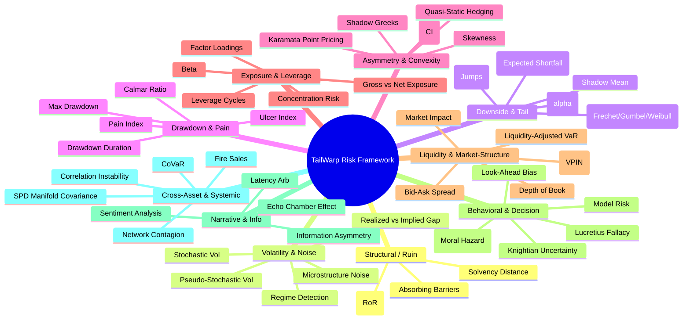

Based on a comprehensive analysis of the provided documents—including MDA/EVT heuristics, the TailWarp risk categories, book mappings from Taleb and Gatheral, and the relevant geometric optimization papers—I have synthesized an expanded risk framework.

This framework not only consolidates the existing "Ten Lenses" but infuses them with **missing methods** critical for **Short-Term Trading**, **Systemic Stability**, and **Decision-Making Risks**.

---

# The Expanded Risk Framework: TailWarp Edition

This section categorizes all identified methods (existing from docs + new additions) into the 10 Lenses.

### Category 1: Structural / Ruin Risk
*Focus: Survival, absorbing barriers, and the probability of system termination.*

1.  **Risk of Ruin (RoR):** The probability of hitting capital zero or a critical threshold that forces liquidation.
2.  **Absorbing Barriers (Lindy Effect):** Modeling "ruin" not as a statistical fluctuation but as a boundary condition that, once crossed, ends the game (e.g., margin call, regulation).
3.  **Survival Probability:** The inverse of ruin; calculating the likelihood of an entity or strategy persisting over $N$ periods under stochastic shocks.
4.  **Solvency Distance:** A metric measuring how many consecutive "worst-case" losses (CVaR events) can be absorbed before insolvency.

### Category 2: Volatility & Noise Categories
*Focus: Distinguishing "breathing" from "earthquakes" and regime detection.*

5.  **Stochastic Volatility Models:** (Gatheral Ch 1) Modeling volatility itself as a random variable rather than constant.
6.  **Pseudo-Stochastic Volatility:** (Taleb Ch 5.6) Recognizing that a constant power-law tail can *look* like changing volatility regimes, preventing false model switches.
7.  **Realized vs. Implied Volatility Gap:** The spread between historical movement and market-priced expectations; a widening gap indicates impending structural change.
8.  **Regime Detection (Markov Switching):** Identifying when the market shifts between "calm" (low variance) and "storm" (high variance/kurtosis) states.
9.  **Microstructure Noise:** Distinguishing true price discovery from high-frequency "jitter" or bid-ask bounce contamination in lower time frames (LTF).

### Category 3: Downside & Tail Categories
*Focus: Extreme loss estimation and "Tail" behavior (not just average volatility).*

10. **Conditional VaR (CVaR) / Expected Shortfall:** The average loss *given* that a VaR threshold is breached. The gold standard for tail risk.
11. **Maximum Domain of Attraction (MDA):** Determining if the data belongs to the Fréchet (Fat Tail), Gumbel (Thin Tail), or Weibull (Bounded) domain.
12. **Tail Index ($\alpha$) Estimation:** Using Hill Estimators or Peaks Over Threshold (POT) to determine the "fatness" of the tail.
13. **The "Shadow Mean":** Estimating the true population mean (which is often infinite or massive) based on the tail index, rather than the biased sample mean.
14. **Gap Risk (Jump-to-Ruin):** Modeling the probability of price discontinuously jumping over stop-loss levels (relevant for LTF and overnight risk).
15. **Jump-Diffusion Models:** Adding Poisson-driven "jumps" to standard Brownian motion to account for sudden, non-continuous price moves.

### Category 4: Drawdown & "Pain" Categories
*Focus: The psychological and capital reality of being underwater.*

16. **Maximum Drawdown (MDD):** The peak-to-trough decline during a specific record period.
17. **Drawdown Duration:** The amount of time spent below the high-water mark (critical for strategy churn and trader psychology).
18. **Ulcer Index:** A downside risk measure that penalizes both the depth and duration of drawdowns, summing the percentage drawdowns squared.
19. **Calmar Ratio:** Annualized return divided by Maximum Drawdown.
20. **Pain Index:** The integral of the drawdown curve over time; a linear measure of "total suffering."
21. **Recovery Factor (or Time):** The average time required to recover from a drawdown to a new equity high.

### Category 5: Asymmetry & Convexity Categories
*Focus: Payoff structure $g(x)$ and benefiting from volatility/disorder.*

22. **Convexity Index (CI):** A score measuring the curvature of the payoff function; $CI > 1$ implies positive convexity (long gamma), $CI < 1$ implies concavity.
23. **The "Karamata Point" Pricing:** Pricing deep out-of-the-money (OTM) options relative to a "known" anchor option using only the tail index $\alpha$, bypassing flawed volatility surfaces.
24. **Shadow Greeks:** Calculating option sensitivities (Delta, Gamma) based on the implied "Shadow Mean" rather than the sample mean, adjusting for tail risk.
25. **Quasi-Static Hedging:** Using static options positions to hedge barrier risks, acknowledging that dynamic delta-hedging fails during jumps/gaps.
26. **Skewness (Third Moment):** Measuring the asymmetry of the return distribution; negative skew implies frequent small gains and rare, large losses.

### Category 6: Exposure & Leverage Categories
*Focus: How much capital is committed and to what factors.*

27. **Leverage Cycles:** (Systemic) Tracking aggregate leverage in the system (margin debt) which predicts the severity of deleveraging events.
28. **Gross vs. Net Exposure:** The absolute value of longs plus shorts (Gross) vs. the difference (Net). High gross + low net often indicates "volatility arbitrage" blow-up risks.
29. **Beta to "The Market":** Sensitivity to broad market movements.
30. **Factor Loadings (Style, Sector, Macro):** Decomposing risk into orthogonal factors (Value, Size, Momentum) to identify unintended concentration.
31. **Concentration Risk:** The percentage of capital allocated to a single asset, sector, or correlation cluster.

### Category 7: Liquidity & Market-Structure Categories
*Focus: The ability to exit and the cost of execution.*

32. **Bid-Ask Spread & Slippage:** The immediate cost of entering/exiting a position.
33. **Market Impact Modeling:** (e.g., Almgren-Chriss) Estimating how a trader's own order flow moves the price against them.
34. **Order Flow Toxicity (VPIN):** Volume-Synchronized Probability of Informed Trading; detects when high-frequency traders or insiders are dominating the flow (predicts crashes).
35. **Depth of Book:** The volume available at specific price levels. Shallow books lead to high gap risk.
36. **Liquidity-Adjusted VaR (LVaR):** Adjusting VaR estimates to account for the widening of spreads and reduced depth during crisis periods.

### Category 8: Behavioral & Decision-Making Risks
*Focus: Risks arising from human limits and organizational incentives.*

37. **Model Risk:** The risk of using the wrong model (e.g., Gaussian for fat tails) or overfitting historical data.
38. **Agency Risk (Moral Hazard):** The risk that traders take excessive risks because they share in the upside but not the downside (e.g., "I'll lose my job but keep my bonus").
39. **Lucretius Fallacy:** The cognitive bias of believing the worst historical event is the worst possible future event.
40. **Knightian Uncertainty:** Distinguishing "risk" (calculable probabilities) from "uncertainty" (unknown probabilities); models fail in uncertainty.
41. **Look-Ahead Bias (Data Snooping):** Accidentally using future data in the decision-making process during backtesting.

### Category 9: Narrative & Information-Structure Categories
*Focus: The divergence between story and data.*

42. **Information Asymmetry:** The advantage of one party over another due to superior information flow (e.g., latency arbitrage).
43. **Latency Arbitrage:** The risk of being "picked off" by faster traders who can see or react to orders before they are fully executed.
44. **Sentiment Analysis (NLP):** Quantifying the "tone" of news and social media to detect collective mania or panic that diverges from fundamentals.
45. **Echo Chamber Effect:** Metrics to detect when information flow is circular (high internal correlation of news) rather than novel, signaling a fragile consensus.

### Category 10: Cross-Asset & Systemic Categories
*Focus: Contagion, networks, and system-wide failure.*

46. **Correlation Instability:** (Taleb Ch 29) The phenomenon where correlations converge to 1 (everything falls together) precisely during crashes, breaking diversification.
47. **Network Contagion (DebtRank):** Measuring how distress propagates through a financial network (e.g., A fails, so B fails, so C fails).
48. **CoVaR (Conditional VaR):** Measuring the contribution of a single institution to the systemic VaR (i.e., "How much does Bank X risk the whole system?").
49. **Fire Sale Externalities:** The risk that forced selling by one participant depresses prices, triggering margin calls and further forced selling by others.
50. **Riemannian Manifold Covariance:** (TailWarp specific) Modeling covariance on the Positive Definite (SPD) manifold to avoid the "averaging of correlation" error that underestimates systemic joint tail risk.

---

# Complete Mindmap

### Summary of Additions
*   **Short-Term Focus:** Added *Microstructure Noise*, *Order Flow Toxicity (VPIN)*, *Market Impact*, *Latency Arb*, and *Gap Risk*. These address the immediate risks of intraday and LTF trading.
*   **Systemic Focus:** Added *Leverage Cycles*, *CoVaR*, *Network Contagion*, and *Fire Sales*. These address risks in the "whole system" beyond simple portfolio correlation.
*   **Decision-Making Focus:** Added *Model Risk*, *Agency Risk*, *Look-Ahead Bias*, and *Knightian Uncertainty*. These address the risks inherent in the *process* of making decisions, not just the market outcomes.